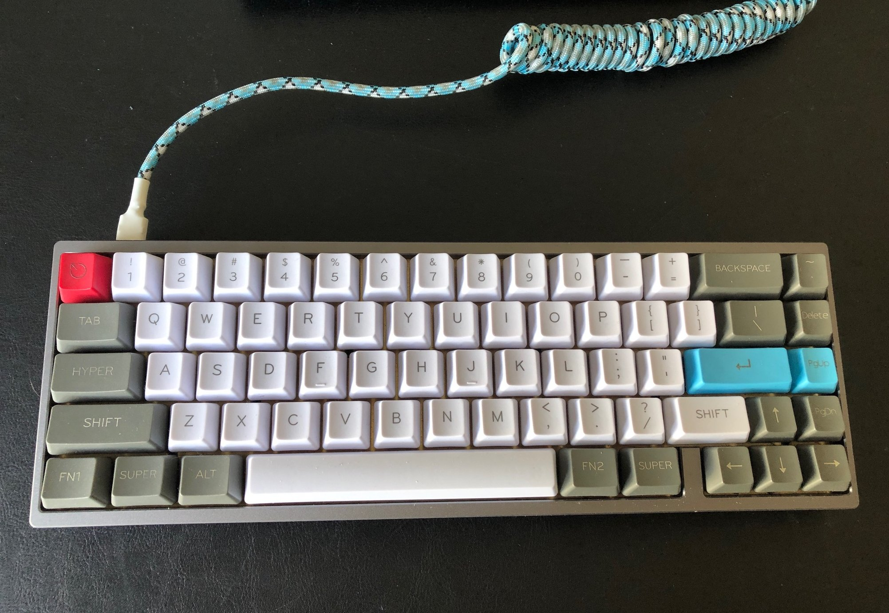

# KBDFans kbd67 rgb mkii

Custom Firmware and keyboard layout for the [KBD67v2 MKII](https://kbdfans.com/products/kbd67v2) mechanical keyboard

## Keyboard Layout

Configured using the [QMK Configurator](https://config.qmk.fm)

### Layer 0

### Layer 1

